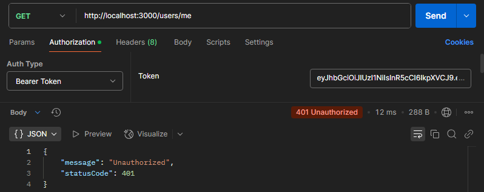

# 마인즈에이아이 백엔드 과제 테스트

NestJS 기반 사용자관련련 백엔드 서비스

## 목차

- [기술스텍](#기술스텍)
- [install](#install)
- [run](#run)
- [test](#test)
- [docker](#docker)
- [구조](#구조)
- [구현](#구현)
- [검증-Postman](#검증-Postman)

## 기술스텍

- 프레임워크: NestJS <br/>
- 언어: TypeScript <br/>
- 인증: @nestjs/jwt, @nestjs/passport, passport, passport-jwt <br/>
- 문서화: @nestjs/swagger, swagger-ui-express <br/>
- 데이터베이스: TypeORM, mysql2 <br/>
- 유효성 검사: class-validator <br/>
- 암호화: bcryptjs <br/>
- 테스트: jest, @nestjs/testing, supertest <br/>

## isntall

```bash
npm install
```

## run

```bash
npm start
```

## test

```bash
npm test
```

## docker
```bash
docker-compose up --build
```

## 구조
```
mindeai-backend-donghyunwi/
├── src/
│   ├── auth/                               # 인증 관련 모듈
│   │   ├── dto/                            
│   │   │   ├── login.dto.ts
│   │   │   └── auth.controller.spec.ts
│   │   ├── auth.controller.ts
│   │   ├── auth.module.ts
│   │   ├── auth.service.spec.ts
│   │   ├── auth.service.ts
│   │   ├── jwt-auth.guard.ts
│   │   ├── jwt.strategy.ts
│   │   └── local-auth.guard.ts
│   ├── common/
│   │   └── filters/
│   │       └── http-exception.filter.ts    # 에러 반환 필터
│   ├── users/                              # 사용자 모듈
│   │   ├── dto/
│   │   │   ├── create-user.dto.ts
│   │   │   └── update-user.dto.ts
│   │   ├── entities/
│   │   │   └── user.entity.ts
│   │   ├── users.controller.spec.ts
│   │   ├── users.controller.ts
│   │   ├── users.module.ts
│   │   ├── users.service.spec.ts
│   │   └── users.service.ts
│   ├── app.controller.spec.ts
│   ├── app.controller.ts
│   ├── app.module.ts
│   ├── app.service.ts
│   └── main.ts                             # main
├── test/                                   # Test 설정
│   ├── app.e2e-spec.ts                    
│   └── jest-e2e.json                       
├── .env                                    # 테스트 목적이므로 gitignore에서 제외        
├── docker-compose.yml                 
├── Dockerfile                         
├── nest-cli.json                      
└── package.json                      
```

## 구현

### A. User API 엔드포인트 구현

- ✅ **사용자 관리 API**: CREATE, LIST, GET, UPDATE, DELETE 엔드포인트를 구현
  - ✅ **사용자 생성**: 인증 없이 호출
  - ✅ **사용자 조회, 수정, 삭제**: JWT 인증을 통해 보호된 경로로 설정

### B. Auth API 엔드포인트 구현

- ✅ **인증 API**: 사용자가 로그인, JWT 토큰을 반환

### C. 데이터베이스 연결

- ✅ **MySQL**: 사용자 정보를 저장하는 테이블을 생성하고 연결을 설정

### D. Docker 구성

- ✅ **컨테이너 실행**: Docker를 사용하여 서버와 데이터베이스가 컨테이너 내에서 실행되도록 설정

### E. API 문서화

- ✅ **Swagger 문서화**: `/api-docs` 엔드포인트에서 API 문서를 제공

### F. README 작성

- ✅ **프로젝트 실행 방법**: Docker를 사용하여 프로젝트를 실행하는 방법을 명세하고, npm script로 실행

### 추가
- ✅ **환경 변수 관리**: 중요한 설정 값은 환경 변수를 사용하여 관리
- ✅ **테스트 코드**: Jest 활용


## 검증-Postman
도커 실행 후 http://localhost:3000/api-docs 에서도 확인 가능합니다.

### Post: /users


<br/>

### Get: /users


### Get: /users/me


<br/>

### Put: /users/me


<br/>

### Delete: /users/me

<br/>

### Post: /users/auth/login


<br/>

